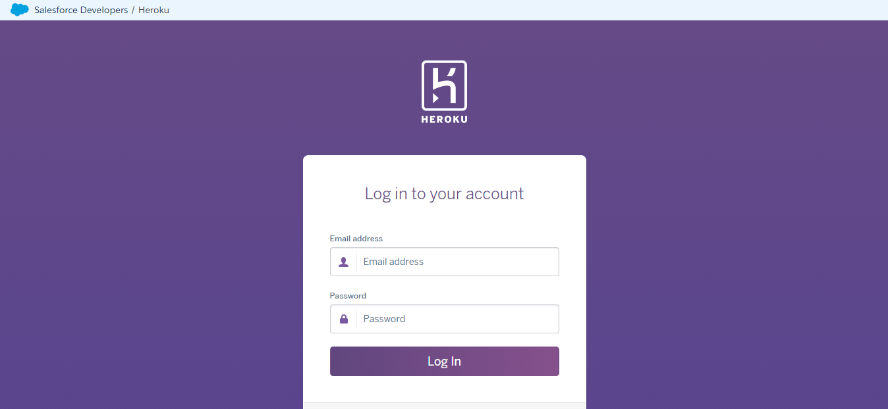
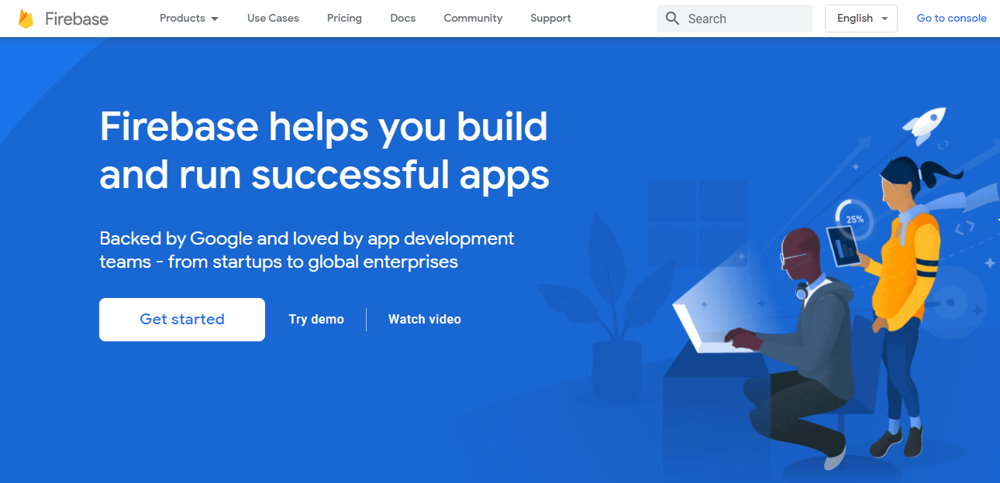
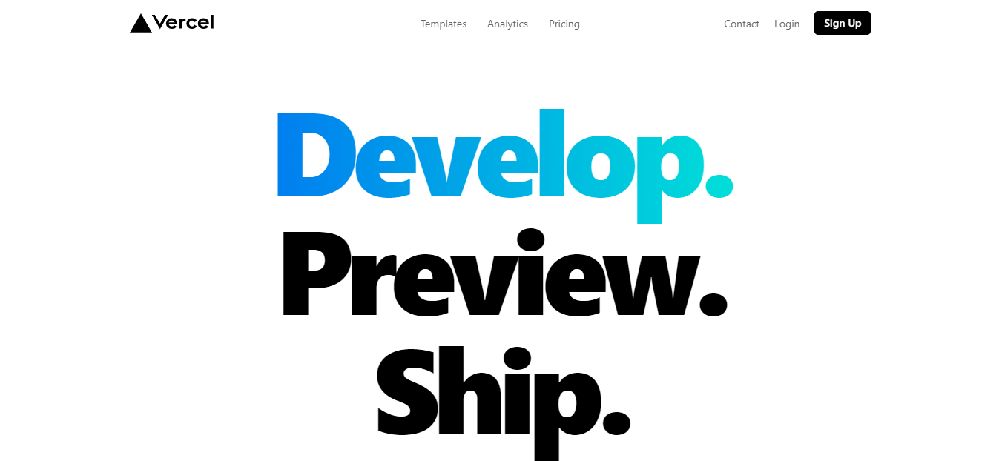
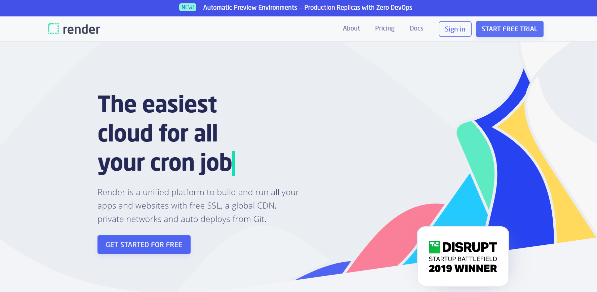
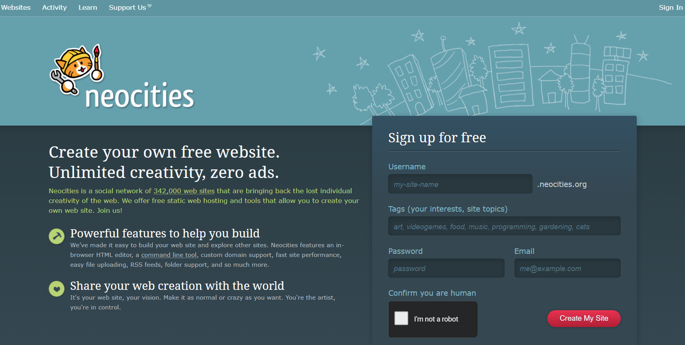
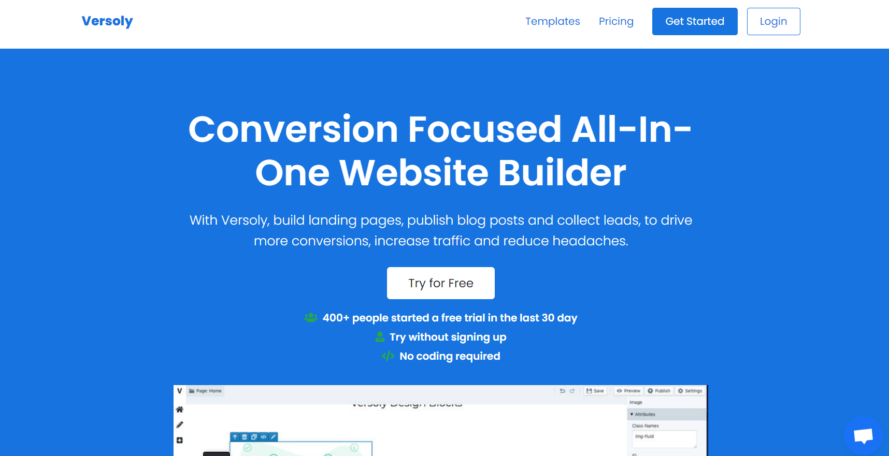
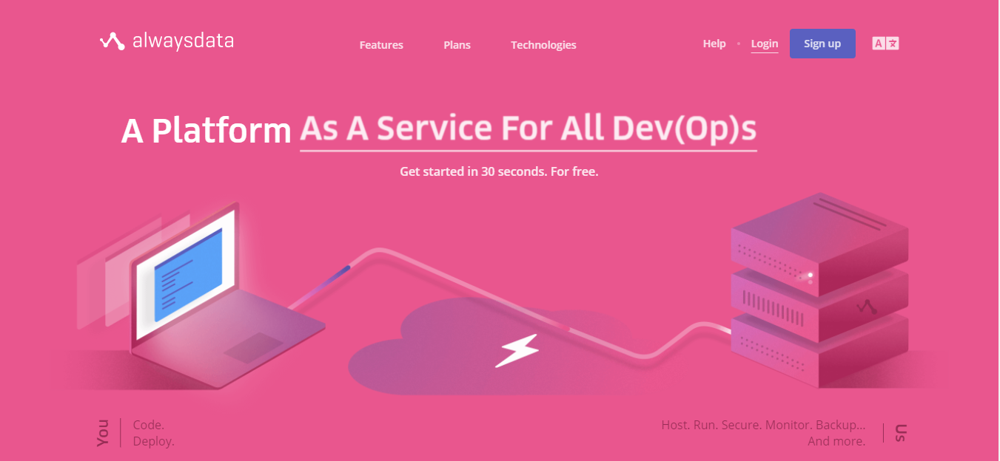

# Free Web Hosting Services for Developers 💻🌍

 

📕 Please read the [Contribution-Guidelines](contribution.md)

### Table of Content
- [What is the importance of free web hosting?](#What) 
- [Can I host my project site 100% free?](#free) 
- [Free web hosting services for developers](#services) 
- [Contributors](#contributors)  

## What is the importance of free web hosting?<a name="What"/>
As the name suggests, free website hosting is a free non-paid web hosting service. There are many web hosts who provide subdomains to anyone who wants to make a website. Some of such popular free web hosts include below. As a student or a developer, these services are most useful for day to day projects.   

## Can I host my project site 100% free?<a name="free"/>
**Yes, you can.!!** Check out the hosting services mentioned below.   

## Free web hosting services for developers<a name="services"/>

### 1. GitHub Pages 
 GitHub Pages is GitHub's answer to project pages, and it allows you to serve any static website straight from your repository. Since GitHub pages support custom domains, you can host a static website on GitHub pages free of charge, with deploys straight from GitHub repository. [(https://pages.github.com/)](https://pages.github.com/)  
   

### 2. Netlify 
  Builds, deploy and hosts static site or app, free for 100 GB data and 100 GB/month bandwidth. Also you can hosting static site directly from GitHub repository. By default, Netlify gives you a **free** custom subdomain whenever you create a new project (something like **mywebsite.netlify.com_**), but they also give you the ability to use a custom domain name which you own and by simply updating your DNS records, your Netlify site will have it's own domain. [(https://www.netlify.com/)](https://www.netlify.com/)  
   

### 3. 000WebHost 
 Zero cost website hosting with Apache, PHP, MySQL, cPanel with ads on the bottom of each pages. Get free PHP web hosting with full MySQL database support and absolutely no ads. 000webhost offer free hosting with almost unrestricted PHP support! Enjoy benefits of latest PHP versions absolutely for free. Unlike other free webhosts, we have PHP and MySQL enabled with no vital limits! [(https://www.000webhost.com/)](https://www.000webhost.com/)  
   

### 4. Heroku 
 Heroku is a container-based cloud Platform as a Service (PaaS). Developers use Heroku to deploy, manage, and scale modern apps. Many of Heroku's add-on partners provide limited free cloud hosting solutions for popular data stores, such as PHP, Redis, MongoDB, MySQL, and Neo4j Graph. A **Free** tier Heroku account allows up to **5 apps**. [(https://dashboard.heroku.com/)](https://dashboard.heroku.com/)  
   
 
 ### 5. Firebase 
 Firebase hosting is free. So, it won't cost you anymore. It by default provides SSL certificate and offers an impressive speed across multiple geographic locations without the need for a separate CDN on top. [(https://firebase.google.com/)](https://firebase.google.com/)  
   
 
 ### 6. Vercel 
 Vercel is a cloud platform for static sites and Serverless Functions that fits perfectly with your workflow. You can build, deploy, and host web apps with free SSL, global CDN, and unique Preview URLs each time you git push. Perfect for Next.js and other Static Site Generators. [(https://vercel.com/)](https://vercel.com/)  
   
 
 ### 7. Render 
 Render is a unified best platform. Render supports you to build and run all your apps and websites with free SSL, a global CDN, private networks and auto deploys from Git. You can take all the services from one place such as Web Apps, Static sites, Background Workers, APIs, Corn Jobs, Dockerfiles, PostgreSQL etc. [(https://render.com/)](https://render.com/)  
   
 
 ### 8. Awardspace 
 Awardspace is consist with a wide range of services. Best opportunity for Web Hosting Solutions for your every need. Free Web Hosting with PHP & MySQL. Create your first website for free and enjoy the service with awardspace. There is a Shared Hosting Service for those who want to start big, and grow bigger. The WordPress Web Hosting Service is the perfect solution for anyone that wants to create a WordPress website. [(https://www.awardspace.com/)](https://www.awardspace.com/)  
   
 
 ### 9. Neocities 
 Neocities is a social network of 342,000 web sites that are bringing back the lost individual creativity of the web. Neocities will offer free static web hosting and tools that allow you to create your own web site. You can create your own free website with Unlimited creativity and zero ads. [(https://neocities.org/)](https://neocities.org/)  
   
 
 ### 10. Versoly 
 Versoly is built on top of the latest technologies such as Amazon Web Services, so you never have to worry about page speeds again. With Versoly, build landing pages, publish blog posts and collect leads, to drive more conversions, increase traffic and reduce headaches. You can create a unique looking landing page in under 30 minutes easily with our 120+ pre-built blocks and templates. [(https://versoly.com/)](https://versoly.com/)  
   
 
 ### 11. Pantheon 
 At Pantheon, Secure the autonomy and tools you need to own and optimize your brand's most visible asset (your website) to boost performance and accelerate growth. Design, test, launch and optimize every project at warp speed with a lean, Agile team. Pantheon is the fastest, most scalable, stable and secure environment for WordPress and Drupal sites. [(https://pantheon.io/)](https://pantheon.io/)  
   
 
 ### 12. Freehostia 
 Freehostia's load-balanced cluster platform has proven to be faster than the widespread one-server hosting platform solution. Their web hosting plans are optimized to work with the most popular PHP web applications: Joomla, WordPress, PrestaShop. They have provided 50 other free applications by their in-house built 1-Click Web Applications Installer. At Freehostia, they offer a variety of web hosting services, from free hosting accounts all the way to VPS and dedicated servers. [(https://freehostia.com/)](https://freehostia.com/)  
   
 
 ### 13. Byte 
 Byet provides you with a massive free, and ad-free load balanced free web hosting service including PHP, MySQL, FTP, Vistapanel & more!. [(https://byet.host/)](https://byet.host/)  
   
 
 ### 14. Alwaysdata 
 100 MB free web hosting with support for MySQL, PostgreSQL, CouchDB, MongoDB, PHP, Python, Ruby, Node.js, Elixir, Java, Deno, custom web servers, access via FTP, WebDAV and SSH; mailbox, mailing list and app installer included. [(https://www.alwaysdata.com/en/)](https://www.alwaysdata.com/en/)  
   
 
 ### 15. Tilda 
 One site, 50 pages, 50 MB storage, only the main pre-defined blocks among 170+ available, no fonts, no favicon and no custom domain. [(https://tilda.cc/)](https://tilda.cc/)  
   

 ### 16. Surge 
 There’s only six keystrokes between you and deployment: Type surge and hit enter in your project directory to get it online immediately.[(https://surge.sh/)](https://surge.sh/)  
   
 

  
## Contributors<a name="contributors"/>
| Lakshitha Dhyan  |    Chathura Ranasinghe    | Dasuni Udugama  |    Samitha Wijesekara    |
| -------------    | ------------- | -------------    | ------------- |
| 

     | 

  | 

     | 

  |

